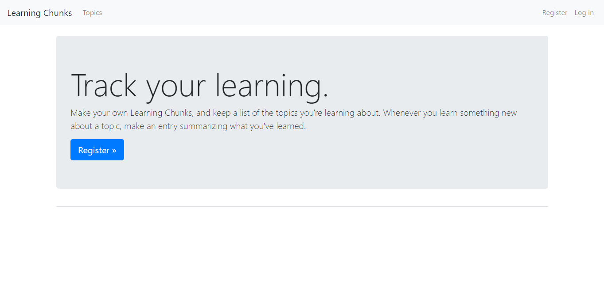

# Learning Log App

A learning log app to understand Django basics.

    

## Django basics

- creating a Django project, starting an app and setting up a superuser.
- defining models for learning topics and entries.
- handling routes, writing views and creating templates for pages.
- implementing a user authentication and registration system.
- allowing users to add/edit their own topics and entries with user-friendly forms.
- styling the pages with Django-Bootstrap4.
- deploying.

Based on [Python Crash Course: A Hands-On, Project-Based Introduction to Programming](https://www.amazon.com/Python-Crash-Course-2nd-Edition/dp/1593279280) by Eric Matthes (2nd edition, 2019)
