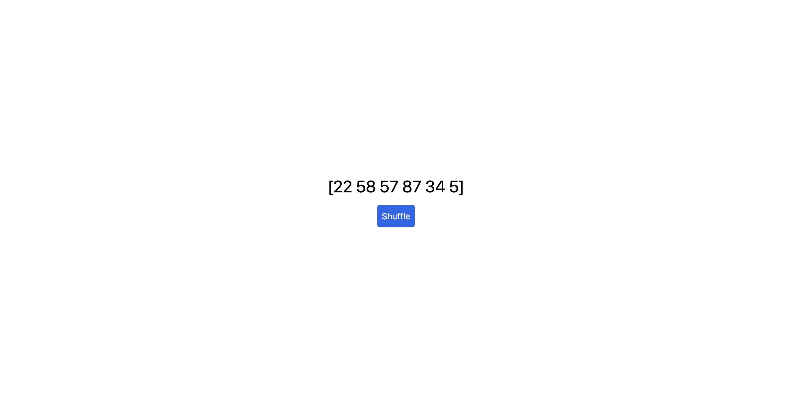

# PyScript Demo

A quick intro to PyScript.

    

## Features

- setting up PyScript.
- disabling Prettier in Visual Studio Code.
- writing Python in HTML.
- mixing JavaScript.
- targetting DOM elements.
- displaying Python REPL in the browser.
- adding Tailwind CSS classes.
- defining environment and importing 3rd party packages.
- using a separate .py file.
- handling events.
- shuffling array.
- using Element().
- using multiple files.

Based on [Python In The Browser! PyScript First Look](https://www.youtube.com/watch?v=vxqBm6_0vyk) by Brad Traversy - Traversy Media (2022).