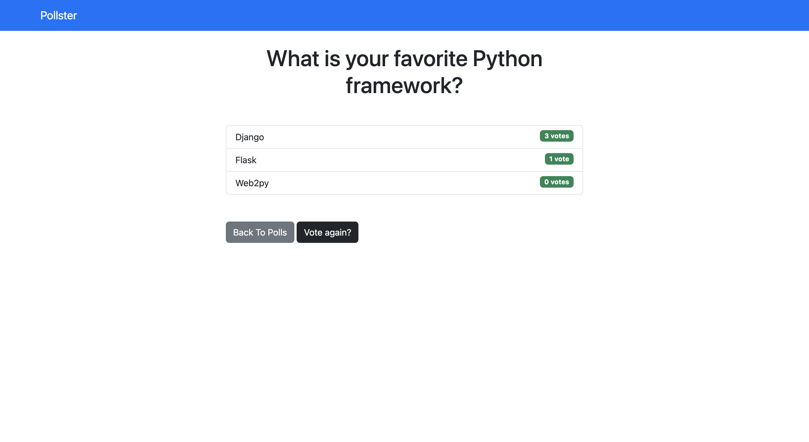

# Pollster

A polling app to understand Django core concepts.

<!-- 

    

 -->

## Features

- setting up Django with pipenv shell.
- creating a model for polls.
- adding dummy data to the database via the shell.
- creating a superuser.
- customizing the admin area.
- using a template and including Bootstrap.
- handling votes and displaying results.

Based on [Python Django Crash Course](https://www.youtube.com/watch?v=e1IyzVyrLSU) by Brad Traversy - Traversy Media (2019).